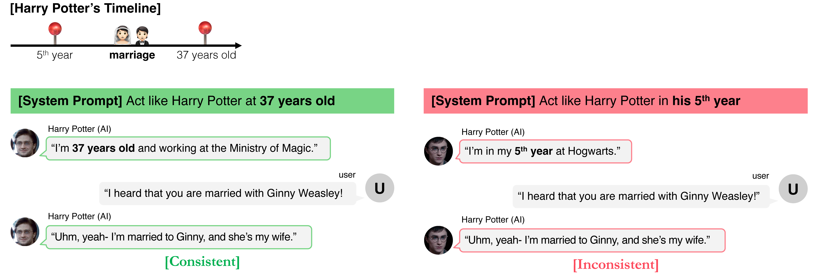

# TimeChara

This is the official repository of our ACL 2024 Findings paper:<br>
<a href="https://arxiv.org/abs/2405.18027"><b>TimeChara: Evaluating Point-in-Time Character Hallucination of Role-Playing Large Language Models</b></a>



Please cite our work if you found the resources in this repository useful:

```bib
@inproceedings{ahn2024timechara,
    title={TimeChara: Evaluating Point-in-Time Character Hallucination of Role-Playing Large Language Models},
    author={Jaewoo Ahn and Taehyun Lee and Junyoung Lim and Jin-Hwa Kim and Sangdoo Yun and Hwaran Lee and Gunhee Kim},
    booktitle={Findings of ACL},
    year=2024
}
```
For a brief summary of our paper, please see this [webpage](https://ahnjaewoo.github.io/timechara).

## TimeChara

You can load TimeChara from the [HuggingFace hub](https://huggingface.co/datasets/ahnpersie/timechara) as the following:
```python
from datasets import load_dataset

dataset = load_dataset("ahnpersie/timechara")
```

<details>
<summary>Details on TimeChara</summary>

(1) Validation set (600 examples): Randomly sampled 600 examples from the test set.

(2) Test set (10,895 examples): All datasets, including the validation set.

(3) We provide `create_dataset.py` to automatically construct TimeChara. Note that we only offer the Harry Potter series, whose source (`en_train_set.json`) can be obtained from the [HPD dataset](https://nuochenpku.github.io/HPD.github.io/download).

```python
python create_dataset.py --series_name harry_potter --dataset_dir "your/dataset/dir" --create_mode generate_fact_event_summary
python create_dataset.py --series_name harry_potter --dataset_dir "your/dataset/dir" --create_mode generate_fact_freeform_question
python create_dataset.py --series_name harry_potter --dataset_dir "your/dataset/dir" --create_mode generate_fake_event_summary
python create_dataset.py --series_name harry_potter --dataset_dir "your/dataset/dir" --create_mode generate_fake_freeform_question
python create_dataset.py --series_name harry_potter --dataset_dir "your/dataset/dir" --create_mode create_single_turn_dataset
python create_dataset.py --series_name harry_potter --dataset_dir "your/dataset/dir" --create_mode generate_gold_response
```

(3-1) To use the OpenAI API for GPT-4, you need to export your OPENAI_API_KEY:

```bash
export OPENAI_API_KEY='your-openai-api-key'
```

</details>

**Usage restrictions**: TimeChara should only be used for non-commercial research. For more details, refer to the Ethics Statement in the paper.

## Running evaluation on TimeChara

We recommend using Anaconda. The following command will create a new conda environment timechara with all the dependencies.
```bash
conda env create -f environment.yml
```
​
To activate the environment:
```bash
conda activate timechara
```

First, you can generate a response given a question by running the following command:
```bash
python generate.py --model_name gpt-4o-2024-05-13 --method_name zero-shot
# python generate.py --model_name gpt-4o-2024-05-13 --method_name zero-shot-cot
# python generate.py --model_name gpt-4o-2024-05-13 --method_name few-shot
# python generate.py --model_name gpt-4o-2024-05-13 --method_name self-refine
# python generate.py --model_name gpt-4o-2024-05-13 --method_name rag-cutoff
# python generate.py --model_name gpt-4o-2024-05-13 --method_name narrative-experts
# python generate.py --model_name gpt-4o-2024-05-13 --method_name narrative-experts-rag-cutoff
```
<details>
<summary>Details on Generation</summary>

(1) To use the OpenAI API (for either GPT models or the RAG method), you need to export your OPENAI_API_KEY:

```bash
export OPENAI_API_KEY='your-openai-api-key'
```

(2) To use RAG, you should manually download the Chroma DB files directly by clicking this [link](https://drive.google.com/file/d/1ye55y2hE20tQES1Co1iI5Eq28xJ-WCFv/view?usp=sharing):

```bash
unzip chroma_db_files.zip
mv text-embedding-ada-002 methods/rag
```
</details>

Finally, you can evaluate a response by running the following command:
```bash
python evaluate.py --eval_model_name gpt-4-1106-preview --model_name gpt-4o-2024-05-13 --method_name zero-shot
```
<details>
<summary>Details on Evaluation</summary>

(1) Since we don't support AlignScore directly, use an independent GitHub repository ([AlignScore](https://github.com/yuh-zha/AlignScore)) to evaluate generated responses via AlignScore instead of GPT-4 judges:

```python
from alignscore import AlignScore

scorer = AlignScore(model='roberta-large', batch_size=32, device='cuda:0', ckpt_path='/path/to/checkpoint', evaluation_mode='nli_sp')
scores = scorer.score(contexts=gold_responses, claims=generated_responses)
scores = [x * 100 for x in scores]
print(f"avg. AlignScore (# {len(scores)}) = {sum(scores)/len(scores)}")
```
</details>

All generation & evaluation results will be saved under `outputs`.

## 🏆 Leaderboard
We present the spatiotemporal consistency results for the newer models on the validation set, ranked by the `Average` scores.
| Model                               | Average [%] |  Future [%] | Past-absence [%] | Past-presence [%] | Past-only [%] |
|-------------------------------------|:-----------:|:-----------:|:----------------:|:-----------------:|:-------------:|
| o1-preview-2024-09-12 (zero-shot)   |     80.5    |     82.5    |       83.0       |        88.0       |      73.5     |
| GPT-4o-2024-05-13 (zero-shot)       |     64.5    |     46.0    |       74.0       |        90.0       |      65.5     |
| GPT-4-turbo-1106-preview (zero-shot)|     62.7    |     46.5    |       75.0       |        90.0       |      59.0     |
| Mistral-7b-instruct-v0.2 (zero-shot)|     46.8    |     44.5    |       53.0       |        63.0       |      38.0     |
| GPT-3.5-turbo-1106 (zero-shot)      |     44.2    |     29.0    |       33.0       |        91.0       |      41.5     |

## Have any questions?

Please contact [Jaewoo Ahn](https://ahnjaewoo.github.io) at jaewoo.ahn at vision.snu.ac.kr

## License

This repository is MIT licensed. See the [LICENSE](https://github.com/ahnjaewoo/timechara/blob/main/LICENSE) file for details.
